---
## Front matter
lang: ru-RU
title: Работа с git
subtitle: Простейший шаблон
author:
  - Мажитов М. А.
institute:
  - Российский университет дружбы народов им. Патриса Лумумбы, Москва, Россия
date: 01 января 1970

## i18n babel
babel-lang: russian
babel-otherlangs: english

## Formatting pdf
toc: false
toc-title: Содержание
slide_level: 2
aspectratio: 169
section-titles: true
theme: metropolis
header-includes:
  - \metroset{progressbar=frametitle,sectionpage=progressbar,numbering=fraction}
  - '\makeatletter'
  - '\beamer@ignorenonframefalse'
  - '\makeatother'
---

# Цель работы

- Изучить идеологию и применение средств контроля версий.
- Освоить умения по работе с git.

---

# Ход работы

**1.** Я создал папку _hello_, а в нем _hello.html_ файл. Далее инициализировался в _git_, изменил _hello.html_ и добавил файл в репозиторий.(рис. [-@fig:001])

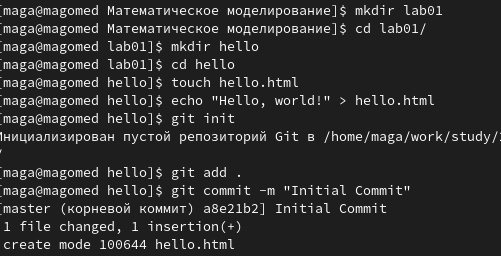{ #fig:001 width=70% }

---

**2.** Далее я добавил теги в _hello.html_ и отправил изменения в индекс git.(рис. [-@fig:002;-@fig:003])

## 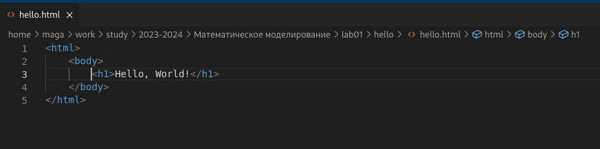{ #fig:002 width=70% }

---

## 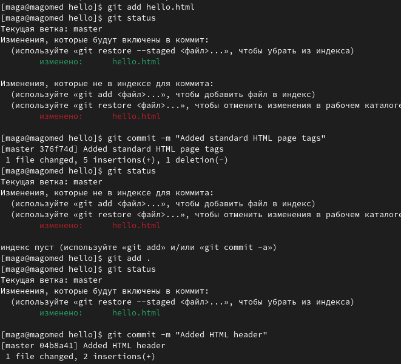{ #fig:003 width=70% }

---

**3.** Получил список проведенных изменений.(рис. [-@fig:004])

## 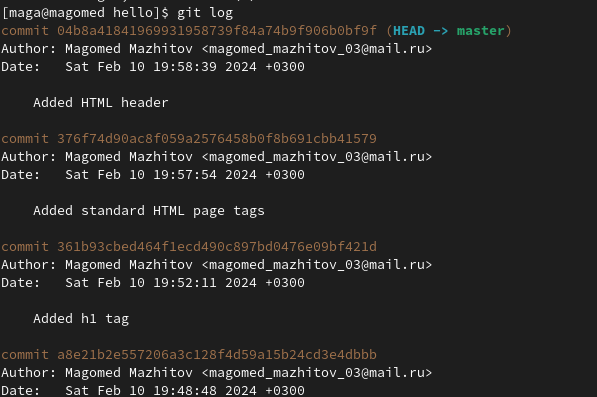{ #fig:004 width=70% }

---

**4.**Затем создал новый tag _v1_. (рис. [-@fig:005])

## 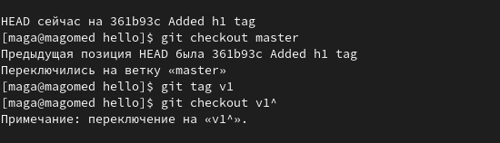{ #fig:005 width=70% }

---

Попробовал переключаться между тегами. (рис. [-@fig:006])

## 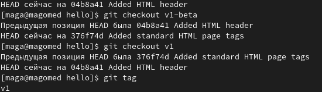{ #fig:006 width=70% }

---

Далее просмотрел все теги. (рис. [-@fig:007])

## 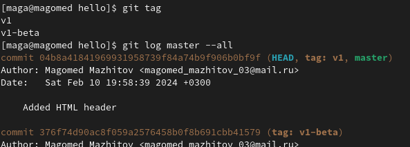{ #fig:007 width=70% }

---

**5.** Внес изменение в файл hello.html в виде нежелательного комментария, проиндексировал это изменение и с помощью команды git reset сбросил буферную зону к HEAD.(рис. [-@fig:008])

## 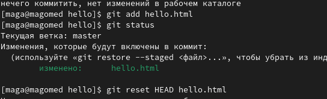{ #fig:008 width=70% }

---

Далее я снова изменил файл hello.html, но в этот раз внес также _commit_. Чтобы отменить коммит, сделал коммит, который удаляет изменения, сохраненные нежелательным коммитом.(рис. [-@fig:009])

## 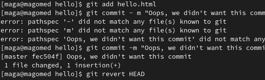{ #fig:009 width=70% }

---

Сбросил коммиты к предшествующим коммиту Oops.(рис. [-@fig:010])

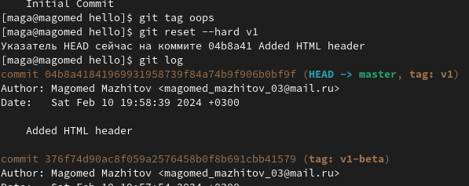{ #fig:010 width=70% }

---

Далее просто удаляем тег _Oops_.(рис. [-@fig:011])

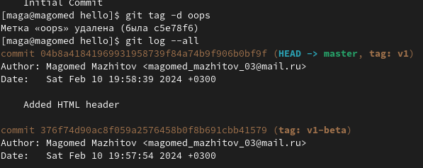{ #fig:011 width=70% }

---

**6.** Дабавил в страницу комментарий, проиндексировал его и закоммитил. Далее я снова внес изменения в _hello.html_ и изменил последний коммит. (рис. [-@fig:012])

## 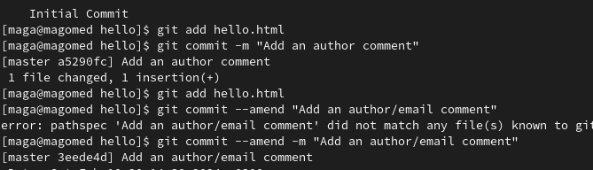{ #fig:012 width=70% }

---

**7.** Создал папку _lib_ и перенес туда _hello.html_ .(рис. [-@fig:013])

## 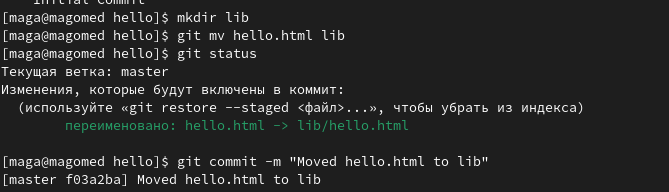{ #fig:013 width=70% }

---

**8.** Далее я создал _index.html_, проиндексировал его и добавил коммит.(рис. [-@fig:014])

## 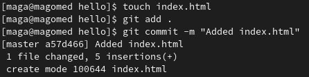{ #fig:014 width=70% }

---

**9.** Создал новую ветку _style_.(рис. [-@fig:015])

## 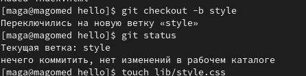{ #fig:015 width=70% }

---

**10.** Добавил файл стилей.(рис. [-@fig:016])

## 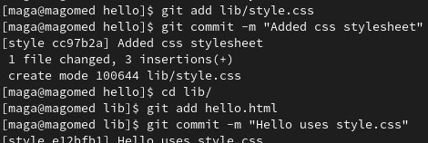{ #fig:016 width=70% }

---

**11.** ДДля переноса изменений из двух веток в одну, сделал слияние _master_ c _style_.(рис. [-@fig:017])

## 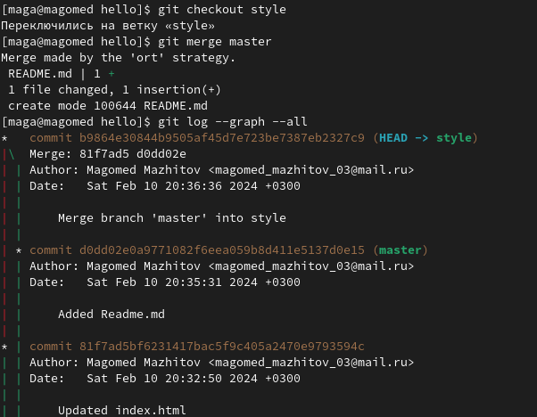{ #fig:017 width=70% }

---

**12.** Вернемся на ветке style к точке перед тем, как мы слили ее с веткой master. Мы
можем сбросить ветку к любому коммиту.(рис. [-@fig:018])

## 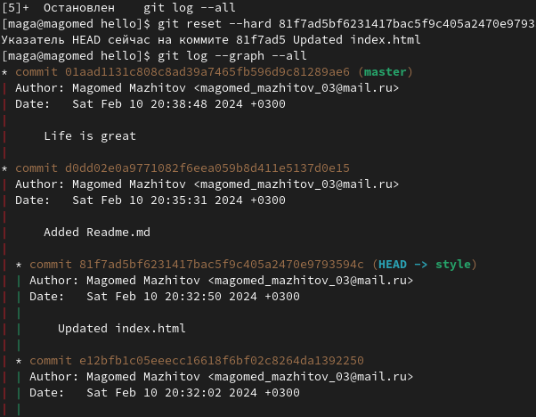{ #fig:018 width=70% }

---

**13.**Создал клон репозитория.(рис. [-@fig:019])

## 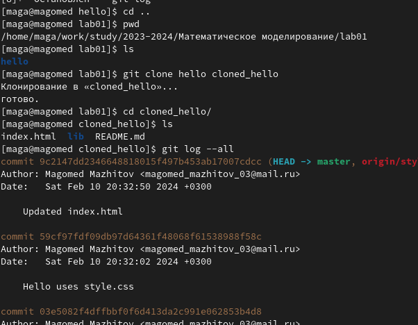{ #fig:019 width=70% }

---

**14.** Прописав команду _git remote_ можно увидеть, что клонированный репозиторий знает об имени по умолчанию удаленного репозитория. Также с помощью _git branch -а_ можно посмотреть все ветки, в том числе удаленные.(рис. [-@fig:020])

## 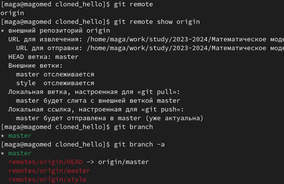{ #fig:020 width=70% }

---

**15.** Далее я создал чистый репозиторий и добавил удаленный репозиторий _hello.git_ к оригинальному репозиторию.(рис. [-@fig:021])

## 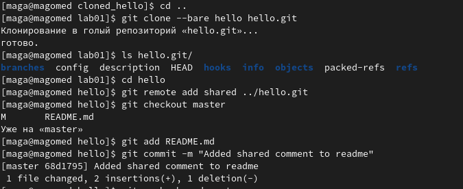{ #fig:021 width=70% }

---

**16.** Запушил все изменения.(рис. [-@fig:022])

## 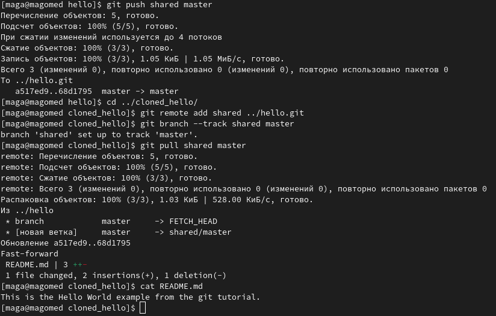{ #fig:022 width=70% }

---

# Вывод

## Мы изучили идеологию и применение средств контроля версий, а также освоили умения по работе с git.
