---
## Front matter
title: "Лабораторная работа №1"
subtitle: "Работа с git"
author: "Магомед Асхабович Мажитов"

## Generic otions
lang: ru-RU
toc-title: "Содержание"

## Bibliography
bibliography: bib/cite.bib
csl: pandoc/csl/gost-r-7-0-5-2008-numeric.csl

## Pdf output format
toc: true # Table of contents
toc-depth: 2
lof: true # List of figures
lot: true # List of tables
fontsize: 12pt
linestretch: 1.5
papersize: a4
documentclass: scrreprt
## I18n polyglossia
polyglossia-lang:
  name: russian
  options:
	- spelling=modern
	- babelshorthands=true
polyglossia-otherlangs:
  name: english
## I18n babel
babel-lang: russian
babel-otherlangs: english
## Fonts
mainfont: PT Serif
romanfont: PT Serif
sansfont: PT Sans
monofont: PT Mono
mainfontoptions: Ligatures=TeX
romanfontoptions: Ligatures=TeX
sansfontoptions: Ligatures=TeX,Scale=MatchLowercase
monofontoptions: Scale=MatchLowercase,Scale=0.9
## Biblatex
biblatex: true
biblio-style: "gost-numeric"
biblatexoptions:
  - parentracker=true
  - backend=biber
  - hyperref=auto
  - language=auto
  - autolang=other*
  - citestyle=gost-numeric
## Pandoc-crossref LaTeX customization
figureTitle: "Рис."
tableTitle: "Таблица"
listingTitle: "Листинг"
lofTitle: "Список иллюстраций"
lotTitle: "Список таблиц"
lolTitle: "Листинги"
## Misc options
indent: true
header-includes:
  - \usepackage{indentfirst}
  - \usepackage{float} # keep figures where there are in the text
  - \floatplacement{figure}{H} # keep figures where there are in the text
---

# Цель работы

- Изучить идеологию и применение средств контроля версий.
- Освоить умения по работе с git.

# Ход работы

**1.** Я создал папку *hello*, а в нем *hello.html* файл. Далее инициализировался в *git*, изменил *hello.html* и добавил файл в репозиторий.(рис. [-@fig:001])

{ #fig:001 width=70% }

**2.** Далее я добавил теги в *hello.html* и отправил изменения в индекс git.(рис. [-@fig:002;-@fig:003])

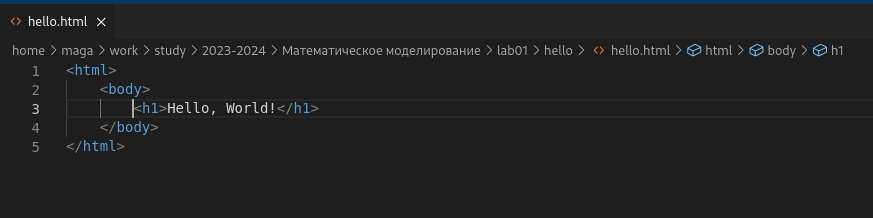{ #fig:002 width=70% }

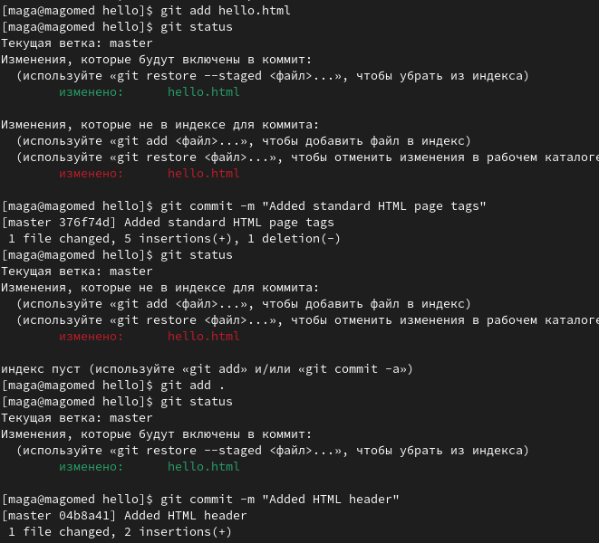{ #fig:003 width=70% }

**3.** Получил список проведенных изменений.(рис. [-@fig:004])

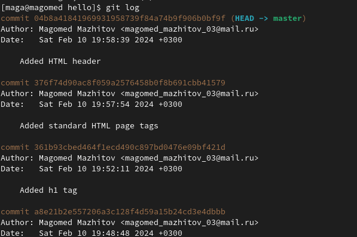{ #fig:004 width=70% }

**4.**Затем создал новый tag *v1*. (рис. [-@fig:005])

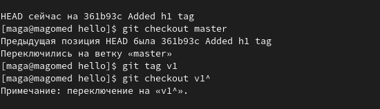{ #fig:005 width=70% }

Попробовал переключаться между тегами. (рис. [-@fig:006])

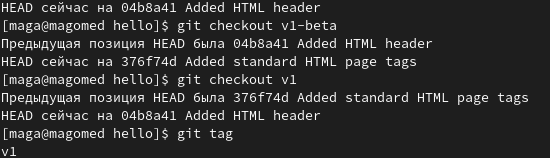{ #fig:006 width=70% }

Далее просмотрел все теги. (рис. [-@fig:007])

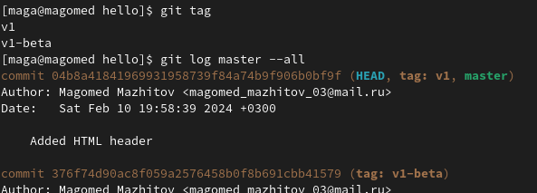{ #fig:007 width=70% }

**5.** Внес изменение в файл hello.html в виде нежелательного комментария, проиндексировал это изменение и с помощью команды git reset сбросил буферную зону к HEAD.(рис. [-@fig:008])

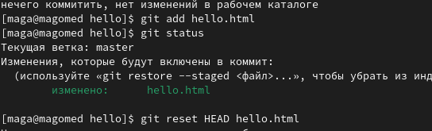{ #fig:008 width=70% }

Далее я снова изменил файл hello.html, но в этот раз внес также *commit*. Чтобы отменить коммит, сделал коммит, который удаляет изменения, сохраненные нежелательным коммитом.(рис. [-@fig:009])

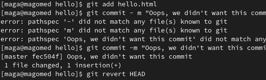{ #fig:009 width=70% }

Сбросил коммиты к предшествующим коммиту Oops.(рис. [-@fig:010])

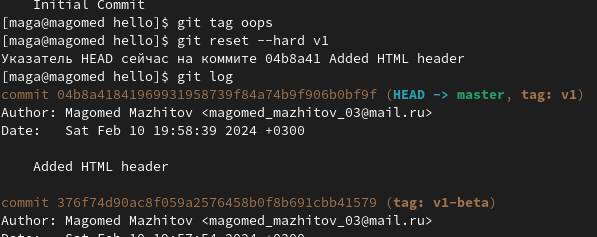{ #fig:010 width=70% }

Далее просто удаляем тег *Oops*.(рис. [-@fig:011])

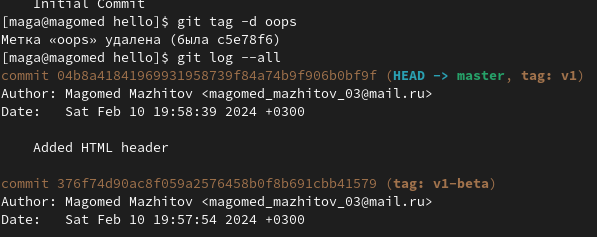{ #fig:011 width=70% }

**6.** Дабавил в страницу комментарий, проиндексировал его и закоммитил. Далее я снова внес изменения в *hello.html* и изменил последний коммит. (рис. [-@fig:012])

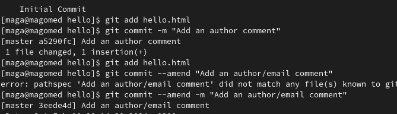{ #fig:012 width=70% }

**7.** Создал папку *lib* и перенес туда *hello.html* .(рис. [-@fig:013])

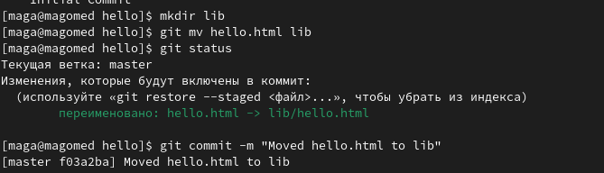{ #fig:013 width=70% }

**8.** Далее я создал *index.html*, проиндексировал его и добавил коммит.(рис. [-@fig:014])

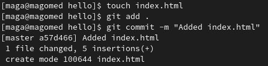{ #fig:014 width=70% }

**9.** Создал новую ветку *style*.(рис. [-@fig:015])

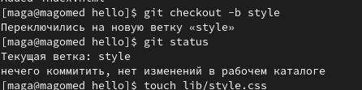{ #fig:015 width=70% }

**10.** Добавил файл стилей.(рис. [-@fig:016])

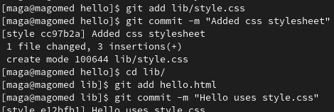{ #fig:016 width=70% }

**11.** ДДля переноса изменений из двух веток в одну, сделал слияние *master* c *style*.(рис. [-@fig:017])

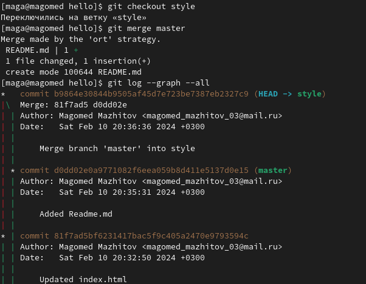{ #fig:017 width=70% }

**12.** Вернемся на ветке style к точке перед тем, как мы слили ее с веткой master. Мы
можем сбросить ветку к любому коммиту.(рис. [-@fig:018])

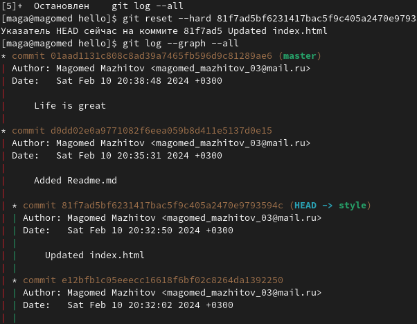{ #fig:018 width=70% }

**13.**Создал клон репозитория.(рис. [-@fig:019])

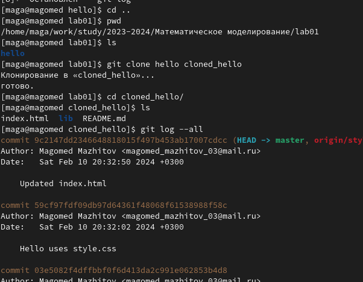{ #fig:019 width=70% }

**14.** Прописав команду *git remote* можно увидеть, что клонированный репозиторий знает об имени по умолчанию удаленного репозитория. Также с помощью *git branch -а* можно посмотреть все ветки, в том числе удаленные.(рис. [-@fig:020])

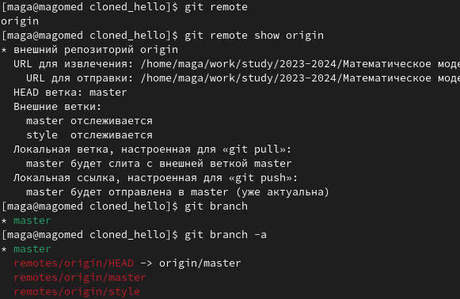{ #fig:020 width=70% }

**15.** Далее я создал чистый репозиторий и добавил удаленный репозиторий *hello.git* к оригинальному репозиторию.(рис. [-@fig:021])

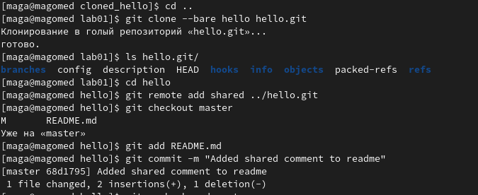{ #fig:021 width=70% }

**16.** Запушил все изменения.(рис. [-@fig:022])

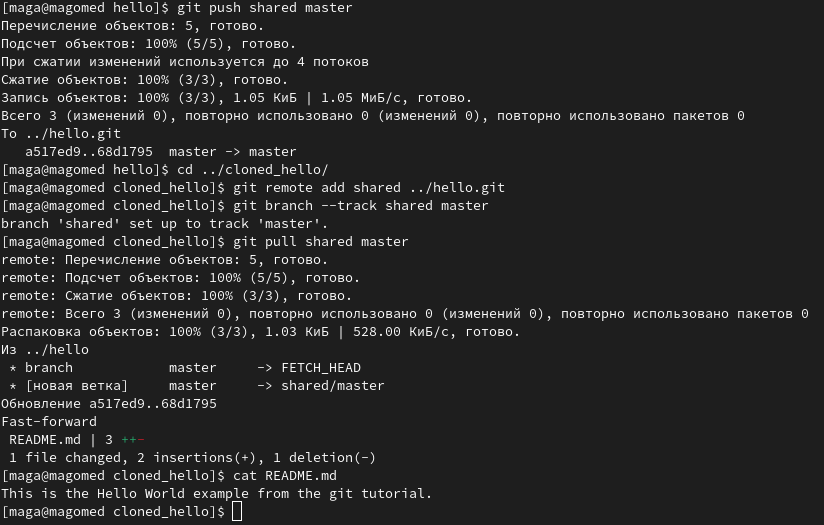{ #fig:022 width=70% }

# Вывод

Мы изучили идеологию и применение средств контроля версий, а также освоили умения по работе с git.