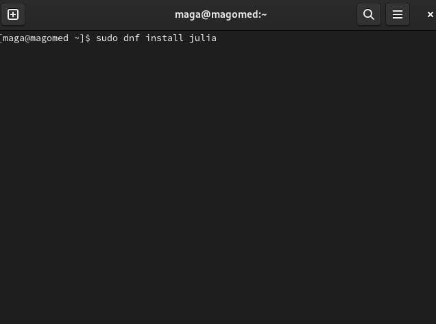
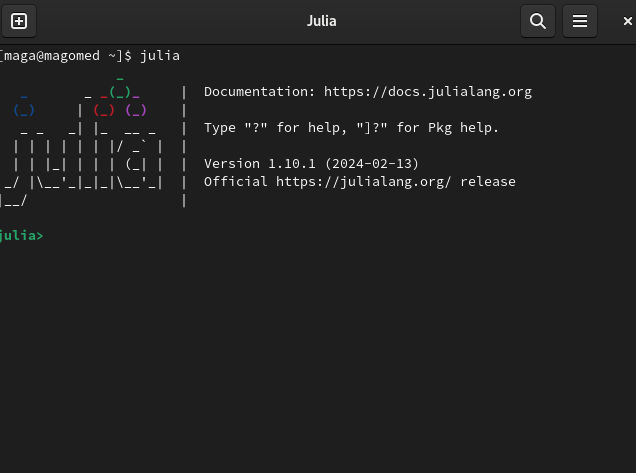
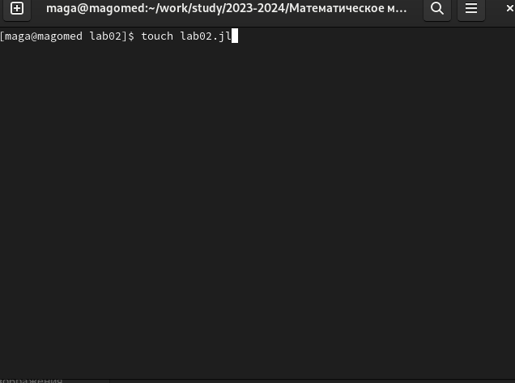
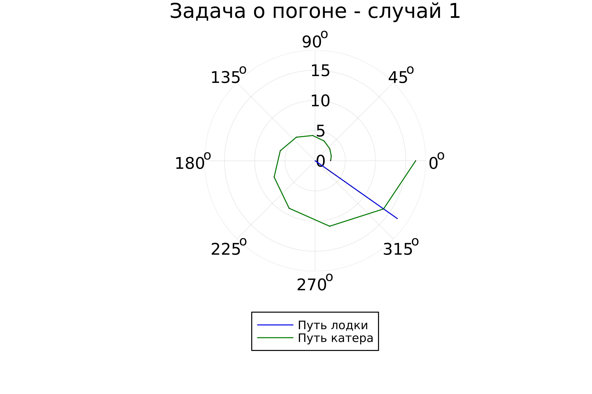
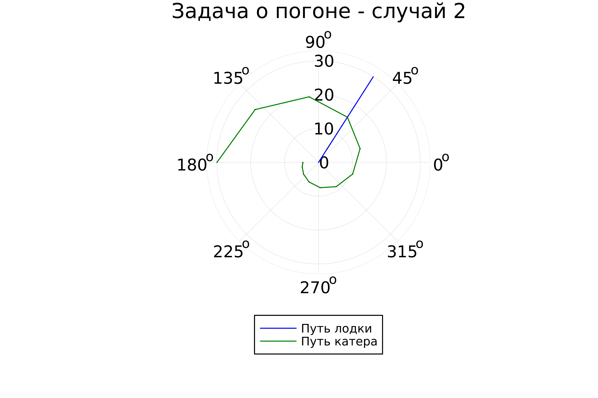

---
## Front matter
title: "Отчёт по лабораторной работе №2


Математическое моделирование"
subtitle: "Задача о погоне. Вариант №32"
author: "Выполнил: Мажитов Магомед Асхабович"

## Generic otions
lang: ru-RU
toc-title: "Содержание"

## Bibliography
bibliography: bib/cite.bib
csl: pandoc/csl/gost-r-7-0-5-2008-numeric.csl

## Pdf output format
toc: true # Table of contents
toc-depth: 2
lof: true # List of figures
fontsize: 12pt
linestretch: 1.5
papersize: a4
documentclass: scrreprt
## I18n polyglossia
polyglossia-lang:
  name: russian
  options:
	- spelling=modern
	- babelshorthands=true
polyglossia-otherlangs:
  name: english
## I18n babel
babel-lang: russian
babel-otherlangs: english
## Fonts
mainfont: PT Serif
romanfont: PT Serif
sansfont: PT Sans
monofont: PT Mono
mainfontoptions: Ligatures=TeX
romanfontoptions: Ligatures=TeX
sansfontoptions: Ligatures=TeX,Scale=MatchLowercase
monofontoptions: Scale=MatchLowercase,Scale=0.9
## Biblatex
biblatex: true
biblio-style: "gost-numeric"
biblatexoptions:
  - parentracker=true
  - backend=biber
  - hyperref=auto
  - language=auto
  - autolang=other*
  - citestyle=gost-numeric
## Pandoc-crossref LaTeX customization
figureTitle: "Рис."
tableTitle: "Таблица"
listingTitle: "Листинг"
lofTitle: "Список иллюстраций"
lolTitle: "Листинги"
## Misc options
indent: true
header-includes:
  - \usepackage{indentfirst}
  - \usepackage{float} # keep figures where there are in the text
  - \floatplacement{figure}{H} # keep figures where there are in the text
---

# Цель работы

Изучить основы языков программирования Julia и OpenModelica. Освоить библиотеки этих языков, которые используются для построения графиков и решения дифференциальных уравнений. Решить задачу о погоне. 

# Теоретическое введение

**Справка о языках программирования:**

Julia — высокоуровневый высокопроизводительный свободный язык программирования с динамической типизацией, созданный для математических вычислений. Эффективен также и для написания программ общего назначения. Синтаксис языка схож с синтаксисом других математических языков (например, MATLAB и Octave), однако имеет некоторые существенные отличия. Julia написан на Си, C++ и Scheme. Имеет встроенную поддержку многопоточности и распределённых вычислений, реализованные в том числе в стандартных конструкциях.

OpenModelica — свободное открытое программное обеспечение для моделирования, симуляции, оптимизации и анализа сложных динамических систем. Основано на языке Modelica. Активно развивается Open Source Modelica Consortium, некоммерческой неправительственной организацией. Open Source Modelica Consortium является совместным проектом RISE SICS East AB и Линчёпингского университета. По своим возможностям приближается к таким вычислительным средам как Matlab Simulink, Scilab xCos, имея при этом значительно более удобное представление системы уравнений исследуемого блока.

**Математическая справка:**

Дифференциальное уравнение — уравнение, которое помимо функции содержит её производные. Порядок входящих в уравнение производных может быть различен (формально он ничем не ограничен). Производные, функции, независимые переменные и параметры могут входить в уравнение в различных комбинациях или отсутствовать вовсе, кроме хотя бы одной производной. Не любое уравнение, содержащее производные неизвестной функции, является дифференциальным. 

В отличие от алгебраических уравнений, в результате решения которых ищется число (несколько чисел), при решении дифференциальных уравнений ищется функция (семейство функций).

Дифференциальное уравнение порядка выше первого можно преобразовать в систему уравнений первого порядка, в которой число уравнений равно порядку исходного дифференциального уравнения. 

**Физические термины:**

- Тангенциальная скорость - составляющая вектора скорости, перпендикулярная линии, соединяющей источник и наблюдателя. Измеряется собственному движению - угловому перемещению источника.
- Радиальная скорость — проекция скорости точки на прямую, соединяющую её с выбранным началом координат.
- Полярная система координат — двумерная система координат, в которой каждая точка на плоскости определяется двумя числами — полярным углом и полярным радиусом.

# Задание

Задания лабораторной работы разделены по вариантам. Мой вариант 32.
Задача о погоне. Вариант 32:

**На море в тумане катер береговой охраны преследует лодку браконьеров.
Через определенный промежуток времени туман рассеивается, и лодка
обнаруживается на расстоянии 11,5 км от катера. Затем лодка снова скрывается в
тумане и уходит прямолинейно в неизвестном направлении. Известно, что скорость
катера в 3,5 раза больше скорости браконьерской лодки.**

# Задачи:

1. Записать уравнение, описывающее движение катера, с начальными условиями для двух случаев (в зависимости от расположения катера относительно лодки в начальный момент времени).
2. Построить траекторию движения катера и лодки для двух случаев.
3. Найти точку пересечения траектории катера и лодки


# Выполнение лабораторной работы

## Математическая модель

1. Примем за момент отсчета времени момент первого рассеивания тумана. Введем полярные координаты с центром в точке нахождения браконьеров и осью, проходящей через катер береговой охраны. Тогда начальные координаты катера (11,5; 0). Обозначим скорость лодки $v$.
2. Траектория катера должна быть такой, чтобы и катер, и лодка все время были на одном расстоянии от полюса. Только в этом случае траектория катера пересечется с траекторией лодки. Поэтому для начала катер береговой охраны должен двигаться некоторое время прямолинейно, пока не окажется на том же расстоянии от полюса, что и лодка браконьеров. После этого катер береговой охраны должен двигаться вокруг полюса удаляясь от него с той же скоростью, что и лодка браконьеров.
3. Чтобы найти расстояние x (расстояние после которого катер начнет двигаться вокруг полюса), необходимо составить следующие уравнение. Пусть через время t катер и лодка окажутся на одном расстоянии x от полюса. За это время лодка пройдет $x$, а катер $11,5 + x$ (или $11,5 - x$, в зависимости от начального положения катера относительно полюса). Время, за которое они пройдут это расстояние, вычисляется как $x\over v$ или ${11,5 - x}\over{3,5v}$ (${11,5 + x}\over{3,5v}$). Так как время должно быть одинаковым, эти величины тоже будут друг другу равны. Из этого получаем объединение из двух уравнений (двух из-за двух разных изначальных позиций катера относительно полюса):

$$ \left[ \begin{array}{cl}
{{x}\over{v}} = {{11,5 - x}\over{3,5v}}\\
{{x}\over{v}} = {{11,5 + x}\over{3,5v}}
\end{array} \right. $$

Из данных уравнений можно найти расстояние, после которого катер начнёт раскручиваться по спирали. Для данных уравнений решения будут следующими: $x_1 = {{115}\over{45}}$, $x_2 = {{115}\over{25}}$. Задачу будем решать для двух случаев. После того, как катер береговой охраны окажется на одном расстоянии от полюса, что и лодка, он должен сменить прямолинейную траекторию и начать двигаться вокруг полюса удаляясь от него со скоростью лодки v. Для этого скорость катера раскладываем на две составляющие: $v_r = {dr\over dt} = v$ - радиальная скорость и $v_\tau = r{d\theta\over dt}$ - тангенциальная скорость.

$$ v_\tau = {{\sqrt{11,25}v}} $$

4. Решение исходной задачи сводится к решению системы из двух дифференциальных уравнений:

$$ \left\{ \begin{array}{cl}
{dr\over dt} = v \\
r{d\theta\over dt} = {{\sqrt{11,25}v}}
\end{array} \right. $$

с начальными условиями 

$$ \left\{ \begin{array}{cl}
\theta_0 = 0 \\
r_0 = x_1 = {{115}\over{45}}
\end{array} \right. $$

или

$$ \left\{ \begin{array}{cl}
\theta_0 = -\pi \\
r_0 = x_2 = {{115}\over{25}}
\end{array} \right. $$

Исключая из полученной системы производную по t, можно перейти к следующему уравнению (с неизменными начальными условиями):

$$ {dr\over d\theta} = {r\over\sqrt{11,25}} $$

Решением этого уравнения с заданными начальными условиями и будет являться траектория движения катера в полярных координатах. [3]

## Решение с помощью программ

### OpenModelica

К сожалению, OpenModelica не адаптирована к использованию полярных координат, поэтому адекватное отображение результатов данный задачи там невозможно. [2]

### Julia

Решить дифференциальное уравнение, расписанное в постановке задачи лабораторной работы, поможет библиотека DifferentialEquations. Итоговые изображения в полярных координатах будут строиться через библиотеку Plots. [1]

1. Для начала установим *Julia*.(рис. [-@fig:001])

{ #fig:001 width=70% }

2. Запустим Julia в командной строке. (рис. [-@fig:002])

{ #fig:002 width=70% }

3. Создаем новый файл с расширением *.jl* (рис. [-@fig:003])

{ #fig:003 width=70% }

4. Пишем программу для решения задач.

```
using Plots
using DifferentialEquations

#Начальные условия
const a = 11.5
const n = 3.5

#r0 для двух случаев
const r0 = a/(n + 1)
const r0_2 = a/(n - 1)

#интервалы
const T = (0, 2*pi)
const T_2 = (-pi, pi)

function F(u, p, t)
    return u / sqrt(n*n - 1)
end

# Первый случай: ОДУ для r0 и T
equat = ODEProblem(F, r0, T)
result = solve(equat, abstol=1e-8, reltol=1e-8)


dxR = rand(1:size(result.t)[1])
rAngles = [result.t[dxR] for i in 1:size(result.t)[1]]

#xoлст1
plt = plot(proj=:polar, aspect_ratio=:equal, dpi = 1000, legend=true, bg=:white)

#параметры для холста
plot!(plt, xlabel="theta", ylabel="r(t)", title="Задача о погоне - случай 1", legend=:outerbottom)
plot!(plt, [rAngles[1], rAngles[2]], [0.0, result.u[size(result.u)[1]]], label="Путь лодки", color=:blue, lw=1)
scatter!(plt, rAngles, result.u, label="", mc=:blue, ms=0.0005)
plot!(plt, result.t, result.u, xlabel="theta", ylabel="r(t)", label="Путь катера", color=:green, lw=1)
scatter!(plt, result.t, result.u, label="", mc=:green, ms=0.0005)

savefig(plt, "lab02_01.png")

# Второй случай: ОДУ для r0_2 и T_2

equat = ODEProblem(F, r0_2 , T_2)
result = solve(equat, abstol=1e-8, reltol=1e-8)
dxR = rand(1:size(result.t)[1])
rAngles = [result.t[dxR] for i in 1:size(result.t)[1]]

#xoлст2
plt1 = plot(proj=:polar, aspect_ratio=:equal, dpi = 1000, legend=true, bg=:white)

#параметры для холста
plot!(plt1, xlabel="theta", ylabel="r(t)", title="Задача о погоне - случай 2", legend=:outerbottom)
plot!(plt1, [rAngles[1], rAngles[2]], [0.0, result.u[size(result.u)[1]]], label="Путь лодки", color=:blue, lw=1)
scatter!(plt1, rAngles, result.u, label="", mc=:blue, ms=0.0005)
plot!(plt1, result.t, result.u, xlabel="theta", ylabel="r(t)", label="Путь катера", color=:green, lw=1)
scatter!(plt1, result.t, result.u, label="", mc=:green, ms=0.0005)

savefig(plt1, "lab02_02.png")

```


### Результаты работы кода на Julia

Результат работы программы для 1 случая.(рис. [-@fig:004])

{ #fig:004 width=70% }

Результат работы программы для 2 случая.(рис. [-@fig:005])

{ #fig:005 width=70% }


# Анализ полученных результатов

Мною были построены графики для обоих случаев. На них получилось отрисовать трактерию катера, траекторию лодки и получилось наглядно найти их точки пересечения. Мы успешно решили задачу о погоне.

# Вывод

Были изучены основы языков программирования Julia и OpenModelica. Освоены библиотеки этих языков, которые используются для построения графиков и решения дифференциальных уравнений. Поскольку OpenModelica не работает с полярными координатами, она пока что не была использована в данной лабораторной работе. 

# Список литературы. Библиография

[1] Документация по Julia: https://docs.julialang.org/en/v1/

[2] Документация по OpenModelica: https://openmodelica.org/

[3] Решение дифференциальных уравнений: https://www.wolframalpha.com/