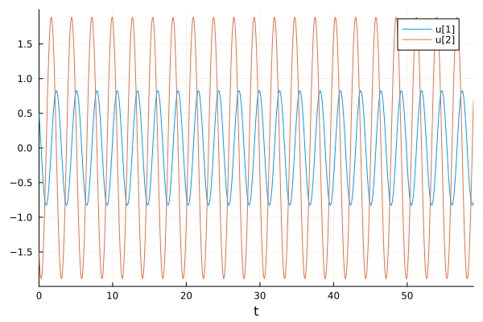
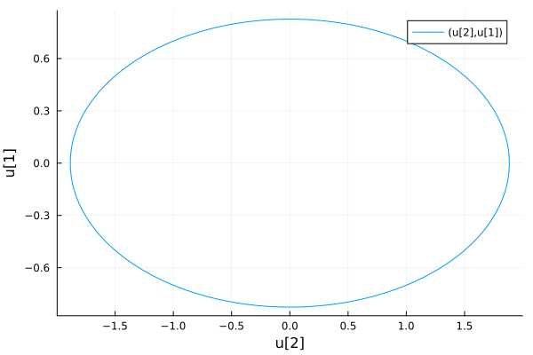
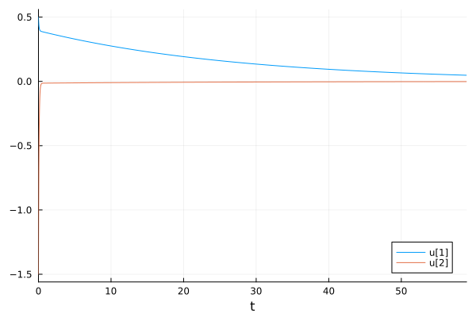
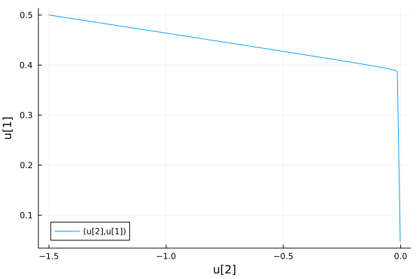
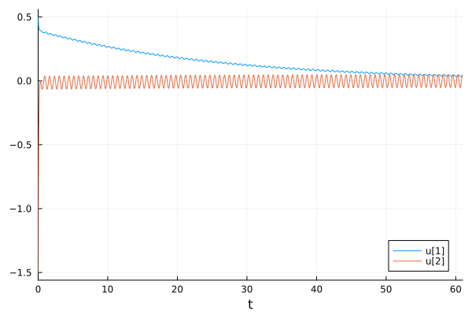
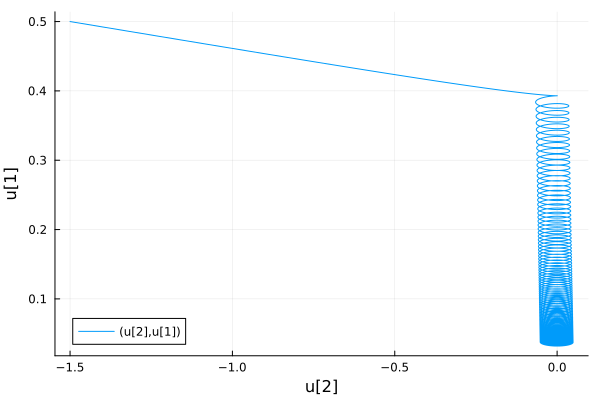

---
## Front matter
lang: ru-RU
title: Лабораторная работа №4
subtitle: Модель гармонических колебаний. Вариант №32
author:
  - Мажитов М. А.
institute:
  - Российский университет дружбы народов, Москва, Россия
date: 24 февраля 2024

## i18n babel
babel-lang: russian
babel-otherlangs: english

## Formatting pdf
toc: false
toc-title: Содержание
slide_level: 2
aspectratio: 169
section-titles: true
theme: metropolis
header-includes:
 - \metroset{progressbar=frametitle,sectionpage=progressbar,numbering=fraction}
 - '\makeatletter'
 - '\beamer@ignorenonframefalse'
 - '\makeatother'
---

## Докладчик

:::::::::::::: {.columns align=center}
::: {.column width="70%"}

  * Мажитов Магомед Асхабович
  * Студент группы НКНбд-01-21
  * Студ. билет 1032216461
  * Российский университет дружбы народов

:::
::: {.column width="30%"}

:::
::::::::::::::

## Цели

Изучить понятие гармонического осцилятора, построить фазовый портрет и найти решение уравнения гармонического осцилятора. 

## Теоретическое введение

- Гармони́ческий осцилля́тор (в классической механике) — система, которая при выведении её из положения равновесия испытывает действие возвращающей силы F, пропорциональной смещению x.

## Теоретическое введение

- Гармоническое колебания - колебания, при которых физическая величина изменяется с течением времени по гармоническому (синусоидальному, косинусоидальному) закону.

## Теоретическое введение

Движение грузика на пружинке, маятника, заряда в электрическом контуре, а также эволюция во времени многих систем в физике, химии, биологии и других науках при определенных предположениях можно описать одним и тем же дифференциальным уравнением, которое в теории колебаний выступает в качестве основной модели. Эта модель называется линейным гармоническим осциллятором.
Уравнение свободных колебаний гармонического осциллятора имеет следующий вид:

$$\ddot{x} + 2\gamma\dot{x} + \omega_0^2=0$$

## Теоретическое введение

где $x$ – переменная, описывающая состояние системы (смещение грузика, заряд конденсатора и т.д.), $\gamma$ – параметр, характеризующий потери энергии (трение вмеханической системе, сопротивление в контуре), $\omega$ – собственная частота колебаний, $t$ – время

Это уравнение есть линейное однородное дифференциальное уравнение
второго порядка и оно является примером линейной динамической системы.

## Теоретическое введение

При отсутствии потерь в системе ($\gamma$ = 0) получаем уравнение консервативного осциллятора энергия колебания которого сохраняется во времени.

$$\ddot{x} + \omega_0^2x = 0$$

## Теоретическое введение

Для однозначной разрешимости уравнения второго порядка необходимо задать два начальных условия вида

$$
 \begin{cases}
	x(t_0)=x_0
	\\   
	\dot{x(t_0)}=y_0
 \end{cases}
$$

## Теоретическое введение

Уравнение второго порядка можно представить в виде системы двух
уравнений первого порядка:

$$
 \begin{cases}
	\dot{x}=y
	\\   
	\dot{y}=-\omega_0^2x
 \end{cases}
$$

Начальные условия для системы примут вид:

$$
 \begin{cases}
	x(t_0)=x_0
	\\   
	y(t_0)=y_0
 \end{cases}
$$

## Теоретическое введение

Независимые переменные x, y определяют пространство, в котором «движется» решение. Это фазовое пространство системы, поскольку оно двумерно будем называть его фазовой плоскостью. 
Значение фазовых координат x, y в любой момент времени полностью определяет состояние системы. Решению уравнения движения как функции времени отвечает гладкая кривая в фазовой плоскости. Она называется фазовой траекторией. Если множество различных решений (соответствующих различным начальным условиям) изобразить на одной фазовой плоскости, возникает общая картина поведения системы. Такую картину, образованную набором фазовых траекторий, называют фазовым портретом.

## Задачи

1. Разобраться в понятии гармонического осцилятора.

2. Ознакомится с уравнением свободных колебаний гармонического осциллятора.

3. Выполнить задание по лабораторной работе.

## Задание

Вариант $№$ 32:

Постройте фазовый портрет гармонического осциллятора и решение уравнения
гармонического осциллятора для следующих случаев:

1. Колебания гармонического осциллятора без затуханий и без действий внешней силы $\ddot{x} + 5.2x = 0$
2. Колебания гармонического осциллятора c затуханием и без действий внешней силы $\ddot{x} + 14\dot{x} + 0.5x = 0$
3. Колебания гармонического осциллятора c затуханием и под действием внешней силы $\ddot{x} + 13\dot{x} + 0.3x = 0.8sin(9t)$

На интервале $t\in [0; 59]$ (шаг 0.05) с начальными условиями $x_0 = 0.5, y_0 = 1.5$

# Выполнение лабораторной работы

## Математическая модель

Опираясь на теоретический материал построим модели на языке Julia.

## Результат работы программы Julia

{ #fig:002 width=70% }

## Результат работы программы Julia

{ #fig:003 width=70% }

## Результат работы программы Julia

{ #fig:004 width=70% }

## Результат работы программы Julia

{ #fig:005 width=70% }

## Результат работы программы Julia

{ #fig:005 width=70% }

## Результат работы программы Julia

{ #fig:006 width=70% }

## Вывод

В ходе лабораторной работы были построены решения уравнения гармонического осцилятора и фазовые портреты гармонических колебаний с различными условиями на языке Julia.

## Список литературы. Библиография

[1] Документация по Julia: https://docs.julialang.org/en/v1/

[2] Решение дифференциальных уравнений: https://www.wolframalpha.com/

[3] Бутиков И. Е. Собственные колебания линейного осциллятора. 2011.