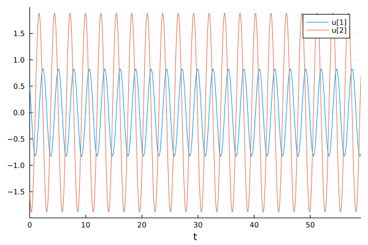
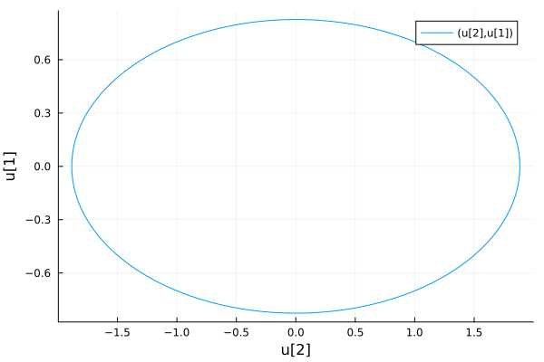
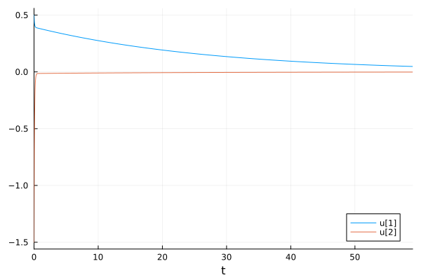
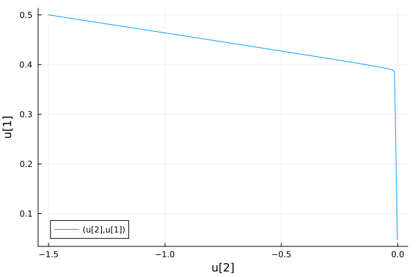
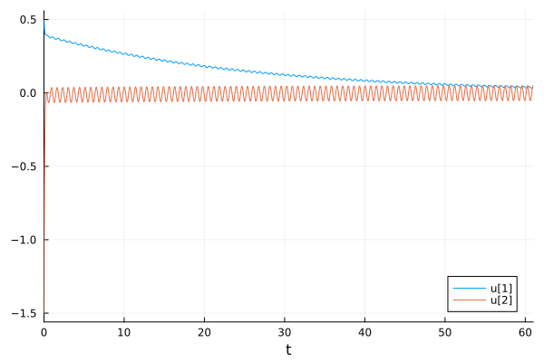
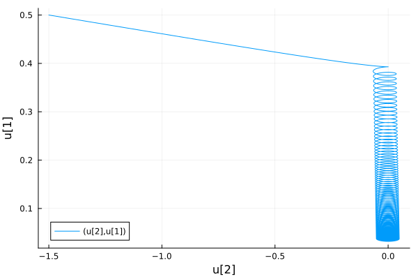

---
## Front matter
title: "Отчёт по лабораторной работе №4


Математическое моделирование"
subtitle: "Модель гармонических колебаний. Вариант №32"
author: "Выполнил: Мажитов Магомед Асхабович"

## Generic otions
lang: ru-RU
toc-title: "Содержание"

## Bibliography
bibliography: bib/cite.bib
csl: pandoc/csl/gost-r-7-0-5-2008-numeric.csl

## Pdf output format
toc: true # Table of contents
toc-depth: 2
lof: true # List of figures
fontsize: 12pt
linestretch: 1.5
papersize: a4
documentclass: scrreprt
## I18n polyglossia
polyglossia-lang:
  name: russian
  options:
	- spelling=modern
	- babelshorthands=true
polyglossia-otherlangs:
  name: english
## I18n babel
babel-lang: russian
babel-otherlangs: english
## Fonts
mainfont: PT Serif
romanfont: PT Serif
sansfont: PT Sans
monofont: PT Mono
mainfontoptions: Ligatures=TeX
romanfontoptions: Ligatures=TeX
sansfontoptions: Ligatures=TeX,Scale=MatchLowercase
monofontoptions: Scale=MatchLowercase,Scale=0.9
## Biblatex
biblatex: true
biblio-style: "gost-numeric"
biblatexoptions:
  - parentracker=true
  - backend=biber
  - hyperref=auto
  - language=auto
  - autolang=other*
  - citestyle=gost-numeric
## Pandoc-crossref LaTeX customization
figureTitle: "Рис."
tableTitle: "Таблица"
listingTitle: "Листинг"
lofTitle: "Список иллюстраций"
lolTitle: "Листинги"
## Misc options
indent: true
header-includes:
  - \usepackage{indentfirst}
  - \usepackage{float} # keep figures where there are in the text
  - \floatplacement{figure}{H} # keep figures where there are in the text
---

# Цель работы

Изучить понятие гармонического осцилятора, построить фазовый портрет и найти решение уравнения гармонического осцилятора. 

# Теоретическое введение

- Гармони́ческий осцилля́тор (в классической механике) — система, которая при выведении её из положения равновесия испытывает действие возвращающей силы F, пропорциональной смещению x.

- Гармоническое колебания - колебания, при которых физическая величина изменяется с течением времени по гармоническому (синусоидальному, косинусоидальному) закону.

Движение грузика на пружинке, маятника, заряда в электрическом контуре, а также эволюция во времени многих систем в физике, химии, биологии и других науках при определенных предположениях можно описать одним и тем же дифференциальным уравнением, которое в теории колебаний выступает в качестве основной модели. Эта модель называется линейным гармоническим осциллятором.
Уравнение свободных колебаний гармонического осциллятора имеет следующий вид:

$$\ddot{x} + 2\gamma\dot{x} + \omega_0^2=0$$

где $x$ – переменная, описывающая состояние системы (смещение грузика, заряд конденсатора и т.д.), $\gamma$ – параметр, характеризующий потери энергии (трение вмеханической системе, сопротивление в контуре), $\omega$ – собственная частота колебаний, $t$ – время

Это уравнение есть линейное однородное дифференциальное уравнение
второго порядка и оно является примером линейной динамической системы.

При отсутствии потерь в системе ($\gamma$ = 0) получаем уравнение консервативного осциллятора энергия колебания которого сохраняется во времени.

$$\ddot{x} + \omega_0^2x = 0$$

Для однозначной разрешимости уравнения второго порядка необходимо задать два начальных условия вида

$$
 \begin{cases}
	x(t_0)=x_0
	\\   
	\dot{x(t_0)}=y_0
 \end{cases}
$$

Уравнение второго порядка можно представить в виде системы двух
уравнений первого порядка:

$$
 \begin{cases}
	\dot{x}=y
	\\   
	\dot{y}=-\omega_0^2x
 \end{cases}
$$

Начальные условия для системы примут вид:

$$
 \begin{cases}
	x(t_0)=x_0
	\\   
	y(t_0)=y_0
 \end{cases}
$$

Независимые переменные x, y определяют пространство, в котором «движется» решение. Это фазовое пространство системы, поскольку оно двумерно будем называть его фазовой плоскостью. 
Значение фазовых координат x, y в любой момент времени полностью определяет состояние системы. Решению уравнения движения как функции времени отвечает гладкая кривая в фазовой плоскости. Она называется фазовой траекторией. Если множество различных решений (соответствующих различным начальным условиям) изобразить на одной фазовой плоскости, возникает общая картина поведения системы. Такую картину, образованную набором фазовых траекторий, называют фазовым портретом.

# Задачи

1. Разобраться в понятии гармонического осцилятора.

2. Ознакомится с уравнением свободных колебаний гармонического осциллятора.

3. Выполнить задание по лабораторной работе.

# Задание

Вариант $№$ 32:

Постройте фазовый портрет гармонического осциллятора и решение уравнения
гармонического осциллятора для следующих случаев:

1. Колебания гармонического осциллятора без затуханий и без действий внешней силы $\ddot{x} + 5.2x = 0$
2. Колебания гармонического осциллятора c затуханием и без действий внешней силы $\ddot{x} + 14\dot{x} + 0.5x = 0$
3. Колебания гармонического осциллятора c затуханием и под действием внешней силы $\ddot{x} + 13\dot{x} + 0.3x = 0.8sin(9t)$

На интервале $t\in [0; 59]$ (шаг 0.05) с начальными условиями $x_0 = 0.5, y_0 = 1.5$

# Выполнение лабораторной работы

## Математическая модель. Решение с помощью программ

### Julia

Программный код решения на Julia

Код программы для 1 случая:

```
using DifferentialEquations

function lorenz!(du, u, p, t)
    a = p
    du[1] = u[2]
    du[2] = -a*u[1]
end

const x = 0.5
const y = -1.5
u0 = [x, y]

p = (5.2)
tspan = (0.0, 59.0)
prob = ODEProblem(lorenz!, u0, tspan, p)
sol = solve(prob, dtmax = 0.05)

using Plots; gr()

#решение системы уравнений
plot(sol)
savefig("lab4_julia_1.png")

#фазовый портрет
plot(sol, vars=(2,1))
savefig("lab4_julia_1_phase.png")

```
Код программы для 2 случая

```
# x'' + 14x' + 0.5x = 0
using DifferentialEquations

function lorenz!(du, u, p, t)
    a, b = p
    du[1] = u[2]
    du[2] = -a*du[1] - b*u[1] 
end

const x = 0.5
const y = -1.5
u0 = [x, y]

p = (14, 0.5)
tspan = (0.0, 59.0)
prob = ODEProblem(lorenz!, u0, tspan, p)
sol = solve(prob, dtmax = 0.05)

using Plots; gr()

#решение системы уравнений
plot(sol)
savefig("lab4_julia_2.png")

#фазовый портрет
plot(sol, vars=(2,1))
savefig("lab4_julia_2_ph.png")

```

Код программы для 3 случая:

```
# x'' + 13x' + 0.5x = 0.8sin(9t)
using DifferentialEquations

function lorenz!(du, u, p, t)
    a, b = p
    du[1] = u[2]
    du[2] = -a*du[1] - b*u[1] + 0.8*sin(9*t)
end

const x = 0.5
const y = -1.5
u0 = [x, y]

p = (13, 0.5)
tspan = (0.0, 61.0)
prob = ODEProblem(lorenz!, u0, tspan, p)
sol = solve(prob, dtmax = 0.05)

using Plots; gr()

#решение системы уравнений
plot(sol)
savefig("lab4_julia_3.png")

#фазовый портрет
plot(sol, vars=(2,1))
savefig("lab4_julia_3_phase.png")

```


### Результаты работы кода на Julia

На следующих рисунках изображены итоговые графики для трех случаев.(рис. [-@fig:001;-@fig:002;-@fig:003;-@fig:004;-@fig:005;-@fig:006])


{ #fig:001 width=70% }

{ #fig:002 width=70% }

{ #fig:003 width=70% }

{ #fig:004 width=70% }

{ #fig:005 width=70% }

{ #fig:006 width=70% }

# Вывод

В ходе лабораторной работы были построены решения уравнения гармонического осцилятора и фазовые портреты гармонических колебаний с различными условиями на языке Julia.

# Список литературы. Библиография

[1] Документация по Julia: https://docs.julialang.org/en/v1/

[2] Решение дифференциальных уравнений: https://www.wolframalpha.com/

[3] Бутиков И. Е. Собственные колебания линейного осциллятора. 2011.