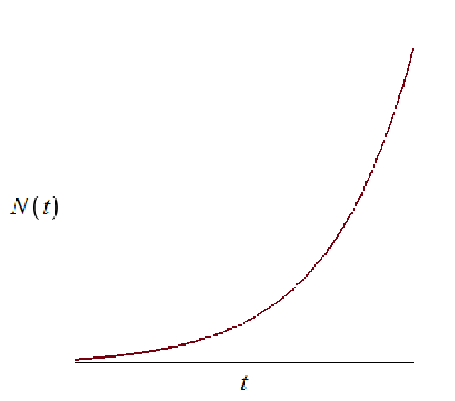

---
## Front matter
lang: ru-RU
title: Лабораторная работа №7
subtitle: Модель распространения рекламы. Вариант №32
author:
  - Мажитов М. А.
institute:
  - Российский университет дружбы народов, Москва, Россия
date: 23 марта 2024

## i18n babel
babel-lang: russian
babel-otherlangs: english

## Formatting pdf
toc: false
toc-title: Содержание
slide_level: 2
aspectratio: 169
section-titles: true
theme: metropolis
header-includes:
 - \metroset{progressbar=frametitle,sectionpage=progressbar,numbering=fraction}
 - '\makeatletter'
 - '\beamer@ignorenonframefalse'
 - '\makeatother'
---

## Докладчик

:::::::::::::: {.columns align=center}
::: {.column width="70%"}

  * Мажитов Магомед Асхабович
  * Студент группы НКНбд-01-21
  * Студ. билет 1032216461
  * Российский университет дружбы народов

:::
::: {.column width="30%"}

:::
::::::::::::::

## Цели

Изучить модель распространения рекламы и построить её.

## Теоретическое введение

Организуется рекламная кампания нового товара или услуги. Необходимо, чтобы прибыль будущих продаж с избытком покрывала издержки на рекламу. Вначале расходы могут превышать прибыль, поскольку лишь малая часть потенциальных покупателей будет информирована о новинке. Затем, при увеличении числа продаж, возрастает и прибыль, и, наконец, наступит момент, когда рынок насытиться, и рекламировать товар станет бесполезным.

## Теоретическое введение

Предположим, что торговыми учреждениями реализуется некоторая продукция, о которой в момент времени $t$ из числа потенциальных покупателей $N$ знает лишь $n$ покупателей. Для ускорения сбыта продукции запускается реклама по радио, телевидению и других средств массовой информации. После запуска рекламной кампании информация о продукции начнет распространяться среди потенциальных покупателей путем общения друг с другом. Таким образом, после запуска рекламных объявлений скорость изменения числа знающих о продукции людей пропорциональна как числу знающих о товаре покупателей, так и числу покупателей о нем не знающих

## Теоретическое введение

Модель рекламной кампании описывается следующими величинами.
Считаем, что $\frac{dn}{dt}$ - скорость изменения со временем числа потребителей, узнавших о товаре и готовых его купить, $t$ - время, прошедшее с начала рекламной кампании, $N$ - общее число потенциальных платежеспособных покупателей, $n(t)$ - число  уже информированных клиентов.

## Теоретическое введение

Эта величина пропорциональна числу покупателей, еще не знающих о нем, это описывается следующим образом: $\alpha _1(t)(N-n(t))$, где $\alpha _1>0$ -  характеризует интенсивность рекламной кампании (зависит от затрат на рекламу в данный момент времени).
Помимо этого, узнавшие о товаре потребители также распространяют полученную информацию среди потенциальных покупателей, не знающих о нем (в этом случае работает т.н. сарафанное радио).

## Теоретическое введение

Этот вклад в рекламу описывается величиной  $\alpha _2(t)n(t)(N-n(t))$. эта величина увеличивается с увеличением потребителей узнавших о товаре.

Математическая модель распространения рекламы описывается уравнением:

$$\frac{dn}{dt} = (\alpha _1(t) + \alpha _2(t)n(t))(N-n(t))$$

## Теоретическое введение

При $\alpha _1(t) >> \alpha _2(t)$ получается модель типа модели Мальтуса, решение которой имеет вид 

{ #fig:0001 width=70% height=70% }

## Теоретическое введение

В обратном случае $\alpha _1(t) << \alpha _2(t)$ получаем уравнение логистической кривой

{ #fig:0002 width=70% height=70% }

## Задание

Вариант 32:

Постройте график распространения рекламы, математическая модель которой описывается следующим уравнением:

1.	$\frac{dn}{dt} = (0.54 + 0.000016n(t))(N-n(t))$
2.	$\frac{dn}{dt} = (0.000021 + 0.38n(t))(N-n(t))$
3.	$\frac{dn}{dt} = (0.2\cos{t} + 0.2\cos{(2t)}  n(t))(N-n(t))$

При этом объем аудитории $N = 609$, в начальный момент о товаре знает 4 человек.

Для случая 2 определите в какой момент времени скорость распространения рекламы будет иметь максимальное значение.

# Выполнение лабораторной работы

## Математическая модель

Опираясь на теоретический материал построим модели на языке Julia.

## Результат работы программы Julia

{ #fig:001 width=70% }

## Результат работы программы Julia

{ #fig:002 width=70% }

## Результат работы программы Julia

{ #fig:002 width=70% }

## Вывод

В ходе выполнения лабораторной работы была изучена и построена модель распространения рекламы на языке Julia.

## Список литературы. Библиография

[1] Документация по Julia: https://docs.julialang.org/en/v1/

[2] Решение дифференциальных уравнений: https://www.wolframalpha.com/

[3] Мальтузианская модель роста: https://www.stolaf.edu//people/mckelvey/envision.dir/malthus.html